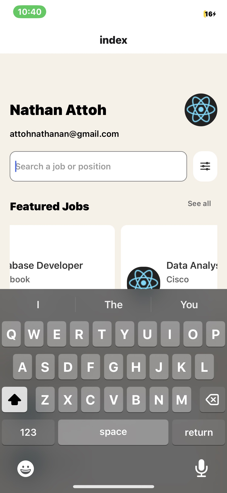
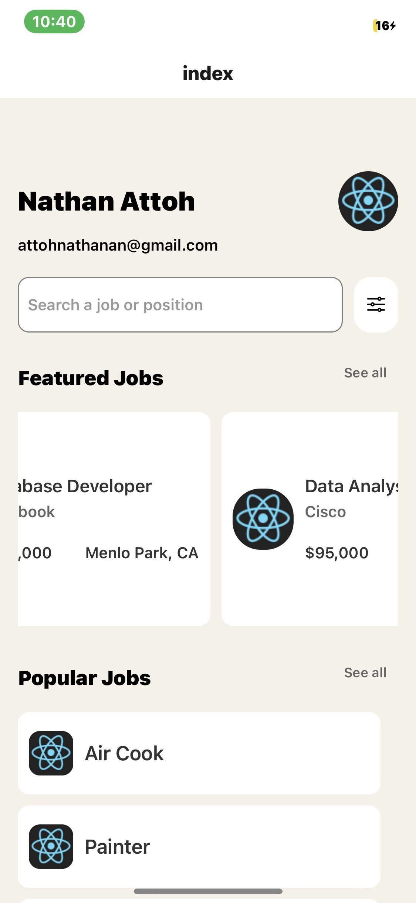
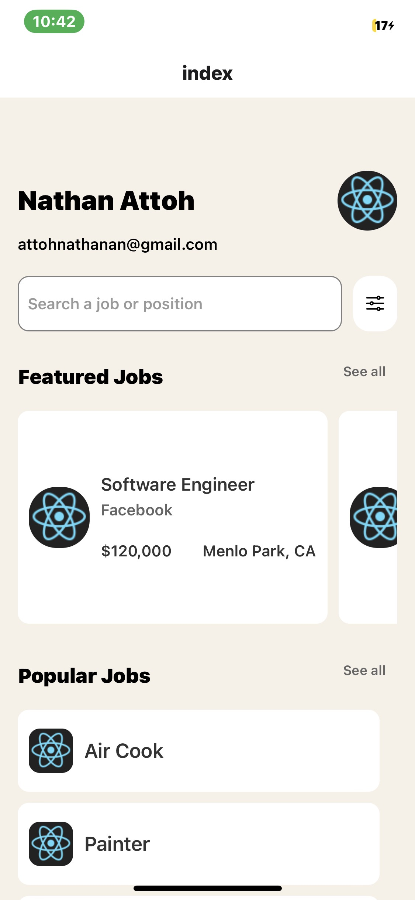
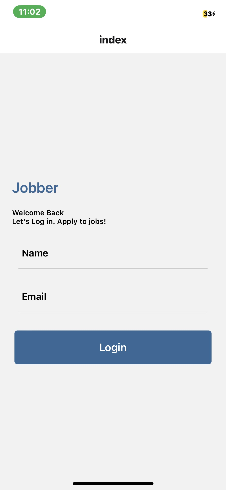
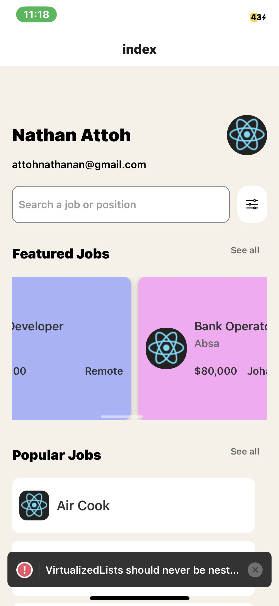
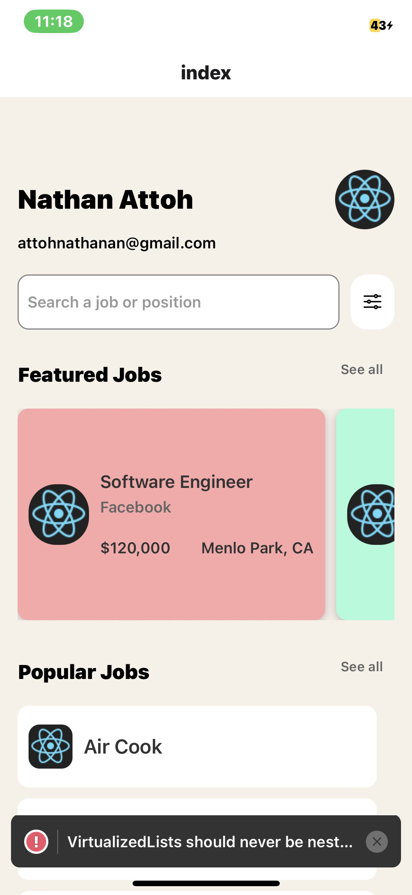

## Student ID - 11357227 

# Job Search App

This is a mobile application built with React Native that allows users to search for jobs and view featured and popular job listings.

## Features

- **Job Search:** Users can search for jobs by entering keywords.
- **Featured Jobs:** Displays a list of featured jobs with details such as job title, company, salary, and location.
- **Popular Jobs:** Shows a list of popular job titles with minimal details.
- **Responsive Design:** Designed to work well on both iOS and Android devices.
- **User Profile:** Includes basic user information and an avatar.

## Screenshots









## Installation

To run the application locally, follow these steps:

1. Clone the repository:

   ```
   git clone https://github.com/your/repository.git
   ```

2. Navigate into the project directory:

   ```
   cd job-search-app
   ```

3. Install dependencies:

   ```
   npm install
   ```

   or

   ```
   yarn install
   ```

4. Run the application:

   - For iOS:
     ```
     npx react-native run-ios
     ```

   - For Android:
     ```
     npx react-native run-android
     ```

5. The application will start on your emulator or connected device.


## Contributing

Contributions are welcome! Please fork the repository and create a pull request with your proposed changes.

## Authors

- [Nathan Attoh](https://github.com/attohx) - Developer
